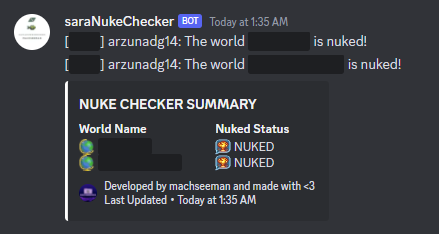

### saraNukeChecker

An automation helper to check your worlds if it's nuked or not!

---

<p align = 'center'>  </p>

If you need help implementing this, feels free to dm me at discord junssekut#4964 or join my [discord server](https://dsc.gg/machseeman).
Note: In order to use the hook functionality without problems, please use Pandora v2.01 as newer version of pandora might cause force close.

## Output
> The output of the script would be:



## How To Use
> Downloading older version of Pandora ( Pandora v2.01 ), open powershell and execute this script below.
```powershell
    $url = "https://cdn.discordapp.com/attachments/1048543416717410335/1053624300000784486/Pandora_v2.01.zip"

    $ProgressPreference = "SilentlyContinue"

    $path_exe 			= "$home/Desktop/scripts/"
    $temp_path 			= "$home/Desktop/scripts/downloaded-temp.zip"
    $temp_path_extract 	= "$home/Desktop/scripts/downloaded-extracted/"
    $exe 				= $temp_path_extract + ".\*.exe"

    Add-Type -AssemblyName System.IO.Compression.FileSystem
    function Unzip
    {
        param([string]$zipfile, [string]$outpath)

        [System.IO.Compression.ZipFile]::ExtractToDirectory($zipfile, $outpath)
    }

    [Net.ServicePointManager]::SecurityProtocol = [Net.SecurityProtocolType]::Tls12 
    Invoke-WebRequest -Uri $url -OutFile $temp_path

    Unzip $temp_path $temp_path_extract

    Move-Item -Path $exe -Destination $path_exe

    Remove-Item -Path $temp_path, $temp_path_extract -Recurse -Force -Confirm:$false
```

> Creating your custom config:
```lua
local config = {
    --- Warning: Using hooks require older version of Pandora (v2.01).

    --- Use hook or not to detect nuked worlds, if you wish to use hook
    --- it's faster but sometimes force close might happen.
    hook = true,

    --- World names to check, only the world name.
    worlds = {

    },

    --- Webhook to send the information into.
    webhook = ''
}
```

> Add this code inside your script (online fetch):
```lua
--- Fetch the online script and load it.
local saraNukeChecker = assert(load(request('GET', 'https://raw.githubusercontent.com/junssekut/saraNukeChecker/main/src/saraNukeChecker-src.lua'))())

--- Initialize with your custom config!
local status, message = pcall(saraNukeChecker.init, config)

if not status then error('An error occured, please see error_logs.txt\n' .. message) end
```

> Add this code inside your script if you want it offline or locally ( not recommended, since you won't get any updates or fixes ):
```lua
--- 'saraNukeChecker.lua' must be the same folder as Pandora.
local saraNukeChecker = require('saraNukeChecker')

--- Initialize with your custom config!
local status, message = pcall(saraNukeChecker.init, config)

if not status then error('An error occured, please see error_logs.txt\n' .. message) end
```
